<p align="center">
	PEMROGRAMAN WEB
</p>
<p align="center">
	TUGAS PRATIKUM 7
</p>
<p align="center">
	Dosen Pengampu : Agung Nugroho, M.Kom
</p>
<p align="center"> 
	<b>Tugas untuk memenuhi syarat penilain pada Pert-9</b>
</p>

<p align="center">
	
</p>

<p align="center">
                 Nama  : Jose Fisto
</p>
<p align="center">
                 NIM   : 312010119
</p>
<p align="center">
                 Kelas : TI.20 A.1
</p>

<br/>
<br/>

<p align="center">
	<b>UNIVERSITAS PELITA BANGSA</b>
</p>
<p align="center">
	<b>FAKULTAS TEKNIK</b>
</p>
<p align="center">
	<b>TEKNIK INFORMATIKA</b>
</p>
<p align="center">
	<b>TA 2021 / 2022</b>
</p>

<br></br>

<hr>
</hr>

<br></br>

# Laporan Praktikum 6

Dipertemuan kali ini akan saya akan mempelajari tentang PHP dasar pada html

1.  Pertama menjalankan web server dari menu XAMPP Control.

<p align="center">
	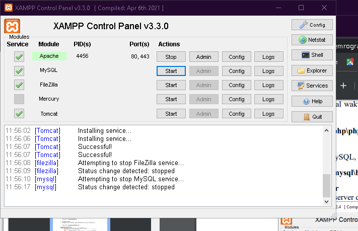
</p>

2. membuat folder lab7_php_dasar dan mengecek di http://localhost/lab7_php_dasar/
<p align="center">
	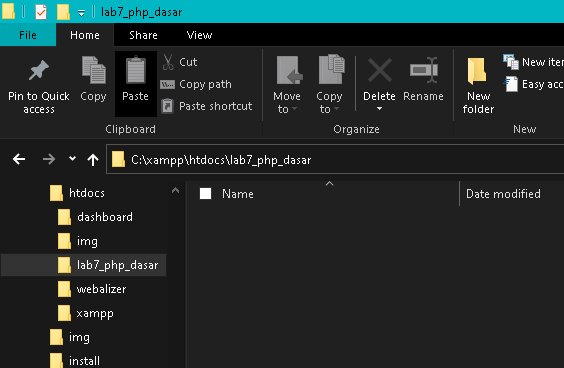
</p>

<p align="center">
	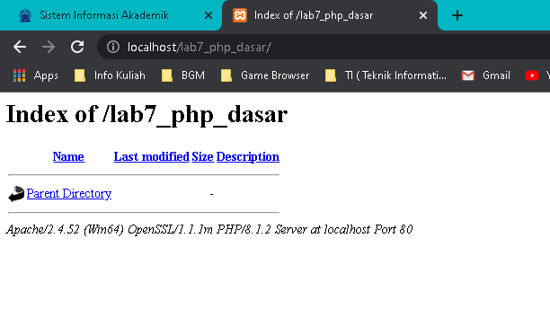
</p>

3. Selanjutnya buat directory pada php_dasar dengan kode berikut.

```php
<!DOCTYPE html>
<html lang="en">
<head>
<meta charset="UTF-8">
<title>PHP Dasar</title>
</head>
<body>
<h1>Belajar PHP Dasar</h1>
<?php
echo "Hello World";
?>
</body>
</html>
```

Berikut hasil output
<p align="center">
	
</p>

4.  menambahkan variable PHP

```php
<?php
$nim = "312010119";
$nama = 'Jose Fisto';
echo "NIM : " . $nim . "<br>";
echo "Nama : $nama";
?>
```

Berikut hasilnya 
<p align="center">
	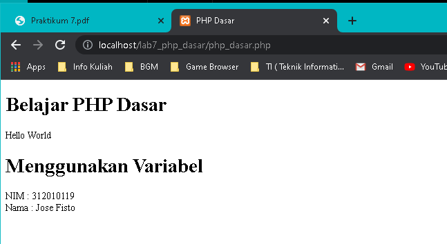
</p>

5.  membuat file latihan2.php dan membuat kode sebagai berikut

```php
<!DOCTYPE html>
<html lang="en">
<head>
<meta charset="UTF-8">
<title>PHP Dasar</title>
</head>
<body>
<h1>Predifine Variable</h1>
<?php
echo 'Selamat Datang ' . $_GET['nama'];
?>
</body>
</html>
```

Menggunakan predivine variabel dengan metode $_GET

Merupakan metode mengambilkan data nilai dari input yang dikirim oleh user. Pada metode get untuk pengiriman data nilai menggunakan HTTP GET sehingga semuanya menjadi array dan tesimpan pada Query String. Query string terletak pada URL halaman web dan ditandai dengan "?". Dan sebagai contoh url halaman sebagai berikut ;

http://localhost/lab7_php_dasar/latihan2.php?nama=Jose%20Fisto

Hasil output PHP :
<p align="center">
	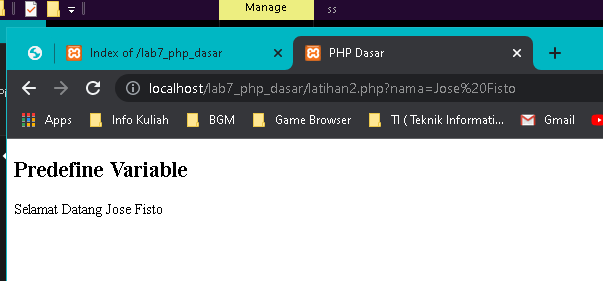
</p>

6. Membuat Form Input

```php
<!DOCTYPE html>
<html lang="en">
<head>
<meta charset="UTF-8">
<title>PHP Dasar</title>
</head>
<body>
<h2>Form Input</h2>
<form method="post">
<label>Nama: </label>
<input type="text" name="nama">
<input type="submit" value="Kirim">
</form>
<?php
echo 'Selamat Datang ' . $_POST['nama'];
?>
</body>
</html>
```
Menggunakan predivine variabel dengan metode $_POST

**$_POST** merupakan metode mengambil nilai dari input yang dikirim oleh user melalui input FORM, baik itu jenis input text, textarea, select, radio box, checkox, dan yang lainnya.

Hasil output
<p align="center">
	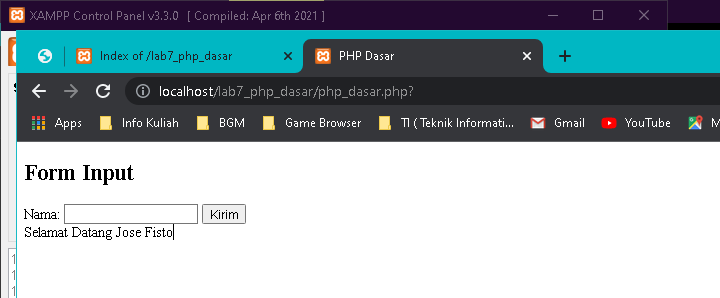
</p>

7. Membuat data Operator

```php
<!DOCTYPE html>
<html lang="en">
<head>
<meta charset="UTF-8">
<title>PHP Dasar</title>
</head>
<body>
<h2>Operator</h2>
<?php
$gaji = 5000000;
$pajak = 0.5;
$thp = $gaji - ($gaji*$pajak);
echo "Gaji sebelum pajak = Rp. $gaji <br>";
echo "Gaji yang dibawa pulang = Rp. $thp";
?>
</body>
</html>
```

dengan hasil
<p align="center">
	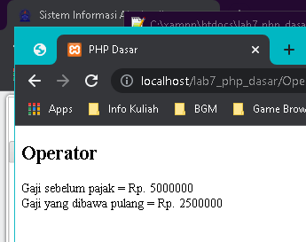
</p>

8.  membuat kondisi IF

```php
<!DOCTYPE html>
<html lang="en">
<head>
<meta charset="UTF-8">
<title>PHP Dasar</title>
</head>
<body>
<h2>Kondisi IF</h2>
<?php
$nama_hari = date("l");
if ($nama_hari == "Sunday") {
 echo "Minggu";
} elseif ($nama_hari == "Monday") {
 echo "Senin";
} elseif ($nama_hari == "Tuesday") {
 echo "Selasa";
} else {
 echo "Rabu";
} 
?>
</body>
</html>
```

Hasil Output
<p align="center">
	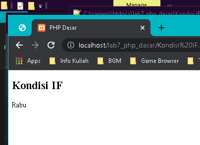
</p>

9.  Membuat data kondisi Switch

```html
<!DOCTYPE html>
<html lang="en">
<head>
<meta charset="UTF-8">
<title>PHP Dasar</title>
</head>
<body>
<h2>Kondisi Switch</h2>
<?php
$nama_hari = date("l");
switch ($nama_hari) {
 case "Sunday":
 echo "Minggu";
 break;
 case "Monday":
 echo "Senin";
 break;
 case "Tuesday":
 echo "Selasa";
 break;
 default:
 echo "Sabtu";
}
?>
</body>
</html>
```

Hasil Output
<p align="center">
	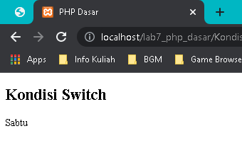
</p>

10.  membuat perulangan For

```html
<!DOCTYPE html>
<html lang="en">
<head>
 <meta charset="UTF-8">
 <title>PHP Dasar</title>
</head>
<body>

<h2>Perulangan For</h2>
 <?php
echo "Perulangan 1 sampai 10 <br />";
for ($i=1; $i<=10; $i++) {
 echo "Perulangan ke: " . $i . '<br />';
}
echo "Perulangan Menurun dari 10 ke 1 <br />";
for ($i=10; $i>=1; $i--) {
 echo "Perulangan ke: " . $i . '<br />';
}
?>
  
</body>
</html>
```

Hasil Output
<p align="center">
	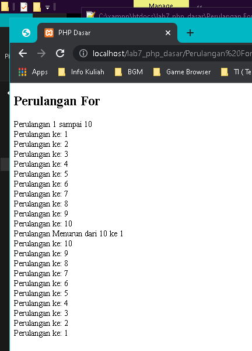
</p>

11.  membuat perulangan while

```html
<!DOCTYPE html>
<html lang="en">
<head>
 <meta charset="UTF-8">
 <title>PHP Dasar</title>
</head>
<body>

<h2>Perulangan While</h2>
<?php
echo "Perulangan 1 sampai 10 <br />";
$i=1;
while ($i<=10) {
 echo "Perulangan ke: " . $i . '<br />';
 $i++;
}
?>
  
</body>
</html>
```

Hasil Output
<p align="center">
	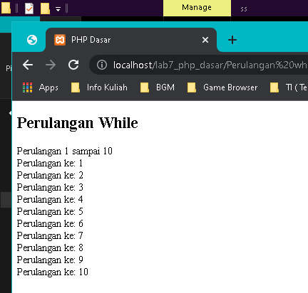
</p>

12.  membuat perulangan Dowhile

```html
<!DOCTYPE html>
<html lang="en">
<head>
 <meta charset="UTF-8">
 <title>PHP Dasar</title>
</head>
<body>

<h2>Perulangan Dowhile</h2>
<?php
echo "Perulangan 1 sampai 10 <br />";
$i=1;
do {
 echo "Perulangan ke: " . $i . '<br />';
 $i++;
} while ($i<=10);
?>
  
</body>
</html>
```

Hasil Output
<p align="center">
	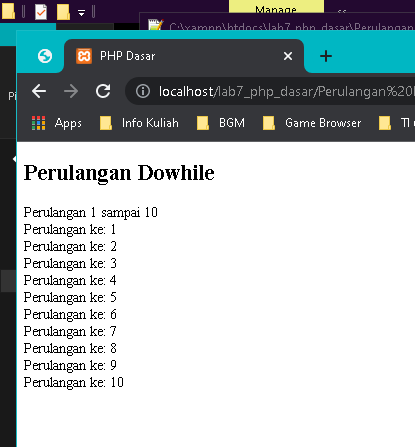
</p>

## Pertanyaan dan Tugas
Buatlah program PHP sederhana dengan menggunakan form input yang menampilkan nama, tanggal lahir dan pekerjaan. Kemudian tampilkan outputnya dengan menghitung umur berdasarkan inputan tanggal lahir. Dan pilihan pekerjaan dengan gaji yang berbeda-beda sesuai pilihan pekerjaan.

Jawaban :

Berikut hasil jawaban dari pertanyaan tersebut :

Form input
<p align="center">
	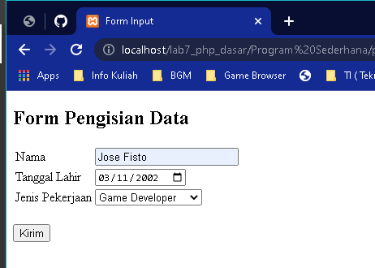
</p>

Hasil Form input / Ouput

Jenis pekerjaan IT Support
<p align="center">
	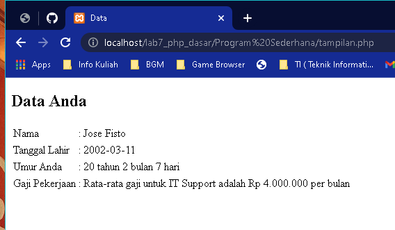
</p>

Jenis pekerjaan Web Developer
<p align="center">
	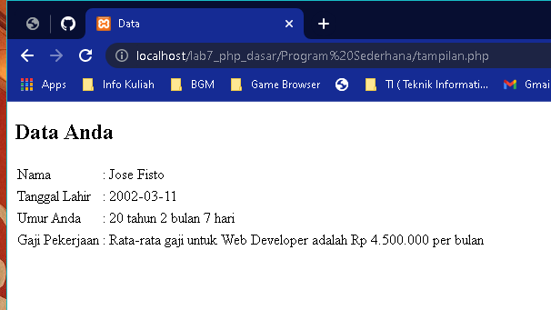
</p>

Jenis pekerjaan Game Developer
<p align="center">
	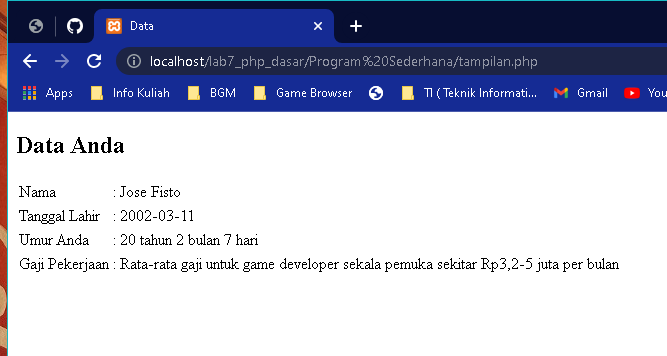
</p>


Berikut Koding dari hasil di atas :

`NOTE` :
Untuk pembuatan hasil di atas menggunakan 2 file yang pertama untuk form input dan satu untuk memanggil data / menghasilkan output data yang di panggil dari file pertama (File Form inputan)

Koding Form Inputan :

```php
<!DOCTYPE html>
<html lang="en">
<head>
    <meta charset="UTF-8">
    <meta http-equiv="X-UA-Compatible" content="IE=edge">
    <meta name="viewport" content="width=device-width, initial-scale=1.0">
    <title>Form Input</title>
</head>
<body>
    <form method="POST" action="tampilan.php">
        <h2>Form Pengisian Data</h2>
        <table>
            <tr>
                <td>Nama</td>
                <td><input type="text" name="nama" placeholder="Nama Anda"></td>
            </tr>
            <tr>
                <td>Tanggal Lahir</td>
                <td><input type="date" name="tgllahir"></td>
            </tr>
            <tr>
                <td>Jenis Pekerjaan</td>
                    <td><select name="pekerjaan" id="">
                        <option value="">--Pekerjaan Anda--</option>
                        <option value="Rata-rata gaji untuk IT Support adalah Rp 4.000.000 per bulan">IT Support</option>
                        <option value="Rata-rata gaji untuk Web Developer adalah Rp 4.500.000 per bulan">Web Developer</option>
                        <option value="Rata-rata gaji untuk game developer sekala pemuka sekitar Rp3,2-5 juta per bulan">Game Developer</option>
                    </select>
                    </td>
            </tr>
        </table>
        <br>
        <td><button type="submit" name="submit" value="submit">Kirim</button></td>
    </form>
</body>
</html>
```
Selanjutnya Save dengan nama **program PHP sederhana.php**

File Kedua, isi koding sebagai berikut

```php
<!DOCTYPE html>
<html lang="en">
<head>
    <meta charset="UTF-8">
    <meta http-equiv="X-UA-Compatible" content="IE=edge">
    <meta name="viewport" content="width=device-width, initial-scale=1.0">
    <title>Data</title>
</head>
<body>
    <table>
    <h2>Data Anda</h2>
    <tr>
        <td>Nama</td>
        <td>:</td>
        <td><?php echo $_POST['nama'] ?></td>
    </tr>
    <tr>
        <td>Tanggal Lahir</td>
        <td>:</td>
        <td><?php echo $_POST['tgllahir'] ?></td>
    </tr>
    <tr>
        <td>Umur Anda</td>
        <td>:</td>
        <td>
            <?php
                $tgllahir = new DateTime($_POST['tgllahir']);
                $sekarang = new DateTime("today");
                if ($tgllahir > $sekarang) { 
                $thn = "0";
                $bln = "0";
                $tgl = "0";
                }
                $thn = $sekarang->diff($tgllahir)->y;
                $bln = $sekarang->diff($tgllahir)->m;
                $tgl = $sekarang->diff($tgllahir)->d;
                echo $thn." tahun ".$bln." bulan ".$tgl." hari";
            ?>
        </td>
    </tr>
    <tr>
        <td>Gaji Pekerjaan</td>
        <td>:</td>
        <td><?php echo $_POST['pekerjaan'] ?></td>
    </tr>
    </table>
</body>
</html>
```

Kemudian Save dengan nama file **tampilan.php**

Selesai